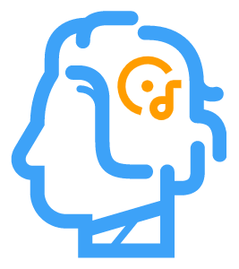

<!--
*** Thanks for checking out the Best-README-Template. If you have a suggestion
*** that would make this better, please fork the repo and create a pull request
*** or simply open an issue with the tag "enhancement".
*** Thanks again! Now go create something AMAZING! :D
***
***
***
*** To avoid retyping too much info. Do a search and replace for the following:
*** github_username, repo_name, twitter_handle, email, project_title, project_description
-->

<!-- PROJECT SHIELDS -->
<!--
*** I'm using markdown "reference style" links for readability.
*** Reference links are enclosed in brackets [ ] instead of parentheses ( ).
*** See the bottom of this document for the declaration of the reference variables
*** for contributors-url, forks-url, etc. This is an optional, concise syntax you may use.
*** https://www.markdownguide.org/basic-syntax/#reference-style-links
-->

[![Contributors][contributors-shield]][contributors-url]
[![Forks][forks-shield]][forks-url]
[![Stargazers][stars-shield]][stars-url]
[![Issues][issues-shield]][issues-url]
[![MIT License][license-shield]][license-url]

<!-- PROJECT LOGO -->
 

  

  <h3 align="center">Johann Sebastian Bot</h3>

  

    A genetic algorithm that creates small musical compositions, exported as MIDI files.
     
    <a href="https://github.com/ShowMeTheRoapes/JohannSebastianBot/issues/new/choose">Report Bug</a>
    ·
    <a href="https://github.com/ShowMeTheRoapes/JohannSebastianBot/issues/new/choose">Request Feature</a>
  

<!-- TABLE OF CONTENTS -->

  
Table of Contents

  <ol>
    <li>
      <a href="#about-the-project">About The Project</a>
      <ul>
        <li><a href="#built-with">Built With</a></li>
        <li><a href="#how-to-run">How to Run</a></li>
      </ul>
    </li>
    <li><a href="#roadmap">Roadmap</a></li>
    <li><a href="#faq">FAQ</a></li>
    <li><a href="#contributing">Contributing</a></li>
    <li><a href="#license">License</a></li>
    <li><a href="#author">Author</a></li>
  </ol>

<!-- ABOUT THE PROJECT -->

## About The Project

Johann Sebastian Bot is a genetic algorithm created by Dustin Roan, Jeremy Schmich, and Alex Hoopes as a project for their Artificial Intelligence course (CS480).

The idea was to generate a number of random pieces of music split into different "populations", objectively measure each piece of music's quality, and then mix the best members of each population to form new pieces of music. Add in some more randomly generated pieces of music and perform this same process over several thousands of generations, and voila! You will have some small pieces of music that sound pretty decent. :)

Feel free to download and play any of the `Sample.mid` files to see Johann's work in action!

### Built With

- [Python](https://www.python.org/)

This was built purely in Python - we used a couple small packages in order to play the music and generate MIDI files, but that's all that was used.

### How To Run

- Docker

  1. `docker compose build`
  2. `docker compose up`
  3. Run will show up in ./currentRun directory

- Python
  1. `pip install -r requirements.txt`
  2. `python bot.py`
  3. Run will show up in ./currentRun directory

<!-- ROADMAP -->

## Roadmap

It has been a while since we've worked on this project, and honestly if we were to work on it again we might just start from scratch and build a Johann v2.0.

That being said, our general ideas for continuing would be to make the music more complex, include other instruments aside from the single MIDI piano, and maybe even develop some kind of website to host the music that Johann Sebastian Bot would create!

See the [open issues](https://github.com/ShowMeTheRoapes/JohannSebastianBot/issues) for a list of proposed features (and known issues).

<!-- FAQ -->

## FAQ

We haven't had any frequently asked questions yet but this is where they'll go. :)

<!-- CONTRIBUTING -->

## Contributing

Contributions are what make the open source community such an amazing place to be learn, inspire, and create. Any contributions you make are **greatly appreciated**.

1. Fork the Project
2. Create your Feature Branch (`git checkout -b feature/AmazingFeature`)
3. Commit your Changes (`git commit -m 'Add some AmazingFeature'`)
4. Push to the Branch (`git push origin feature/AmazingFeature`)
5. Open a Pull Request

<!-- LICENSE -->

## License

Distributed under the GPL 2.0 License. See `LICENSE` for more information.

<!-- CONTACT -->

## Author

Authors:

- [Dustin Roan](https://github.com/jango2106)
- [Alex Hoopes](https://github.com/ahoopes16)
- [Jeremy Schmich](https://github.com/keemhs)
   

<!-- MARKDOWN LINKS & IMAGES -->
<!-- https://www.markdownguide.org/basic-syntax/#reference-style-links -->

[contributors-shield]: https://img.shields.io/github/contributors/ShowMeTheRoapes/JohannSebastianBot.svg?style=for-the-badge
[contributors-url]: https://github.com/ShowMeTheRoapes/JohannSebastianBot/graphs/contributors
[forks-shield]: https://img.shields.io/github/forks/ShowMeTheRoapes/JohannSebastianBot.svg?style=for-the-badge
[forks-url]: https://github.com/ShowMeTheRoapes/JohannSebastianBot/network/members
[stars-shield]: https://img.shields.io/github/stars/ShowMeTheRoapes/JohannSebastianBot.svg?style=for-the-badge
[stars-url]: https://github.com/ShowMeTheRoapes/JohannSebastianBot/stargazers
[issues-shield]: https://img.shields.io/github/issues/ShowMeTheRoapes/JohannSebastianBot.svg?style=for-the-badge
[issues-url]: https://github.com/ShowMeTheRoapes/JohannSebastianBot/issues
[license-shield]: https://img.shields.io/github/license/ShowMeTheRoapes/JohannSebastianBot.svg?style=for-the-badge
[license-url]: https://github.com/ShowMeTheRoapes/JohannSebastianBot/blob/master/LICENSE.txt
[product-screenshot]: images/clotho-demo.gif
